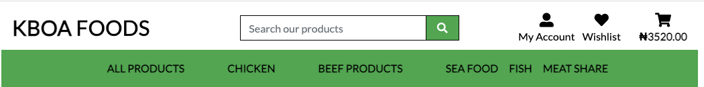
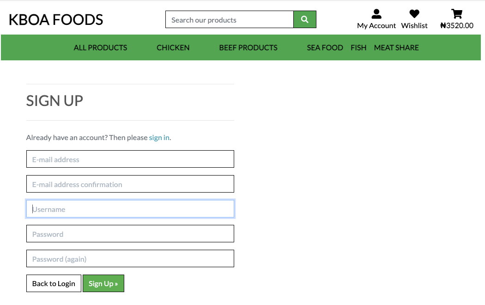
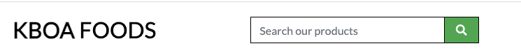
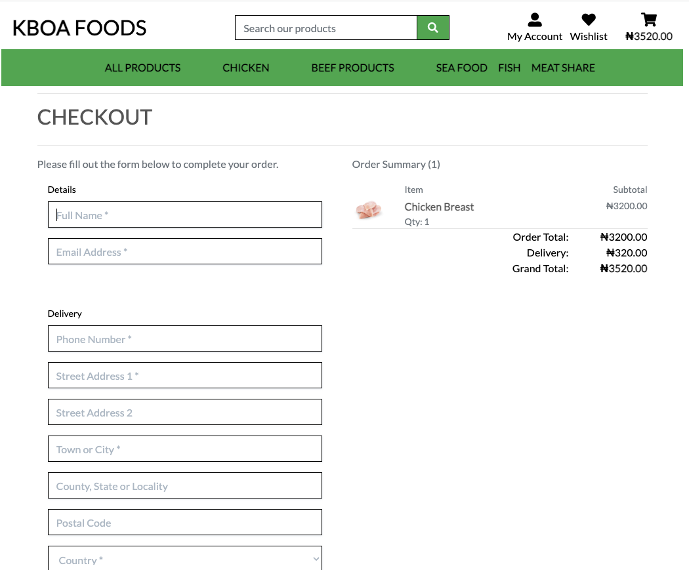
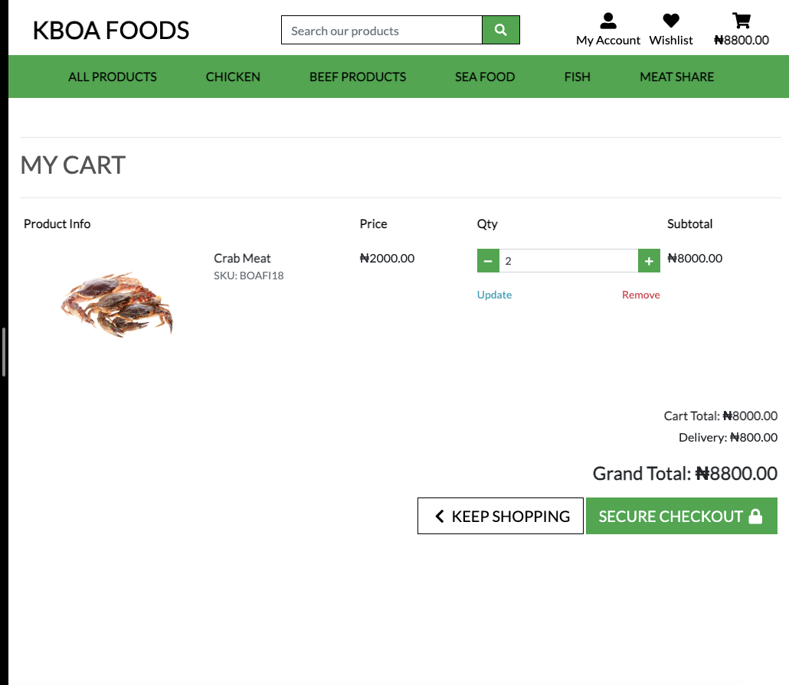

# KBOA Foods
KBOA Foods is an ecommerce foodstore in Gbagada Lagos Nigeria. The web application was built for ease of shopping from anywhere and the items delivered to the client's location.
The store is a full fledge ecommerce application that has been integrated with AWS and Stripe for payment details to conclude its transaction.

 Users with the weblink can shop from the website 

 Only registered users have access to crud functionalities on the application 

 Users are able to checkout their order. 

 Users are able to complete their order using stripe 

https://kboa-foods.herokuapp.com/

## Our Main goal:
<ul>
<li> to provide the ease of shopping from anywhere
<li> support with ready to cook foods
<li> to be accessible to our target audience in their various locations.
</ul>

### Content Strategy
<ul>
<li> user-friendly
<li> stand-out design with beautiful colors
<li> easy to use navigations
</ul>

### Target Audience:
Our application is targeted at online shoppers who would rather shop from the comfort of their home/environment. 

## User Story:
<ul>
<li> Navigation
    <ul>
    <li> A site shopper can view a list of products from the main navigation
    <li> A site shopper can quickly find products from the main navigation without having to search through all the products
    <li> A site user can easily view the total in the cart to avoid spending too much
    </ul> 

<li> Registration and Accounts
    <ul>
    <li> A site user can easily register for an account.
    <li> A site user can easily login or logout
    <li> A site user receive an email confirmation after registration
    <li> A site user can have a personalized user profile.
    </ul>

<li> Sort and Search
    <ul> 
    <li> Shoppers can easily find a specific product they would like to purchase
    <li> Shoppers can quickly decide if the product they want is available.
    </ul>

    

<li> Purchase and Checkout
    <ul>
    <li> Shoppers can view order confirmation before checkout
    <li> Shoppers can confidently provide their payment information to make a purchase
    <li> Shoppers will receive an email confirmation after checkout
    </ul>

<li> Shopping Cart
    <ul> 
    <li> Shoppers can view items in the shopping cart
    <li> Shoppers can adjust items in their shopping cart
    <li> A site shopper can edit/update items from the shopping cart
    </ul>

<li> Wishlist
    <ul> 
    <li> This section has the social media icons, so users can find more information about the yoruba club on facebook, instagram, twitter and youtube.
    <li> The icons when click on takes the user to the respective url.
    <li> It gives the users ability to find and contact the club if they need to.
    </ul>

</ul>

<li> Social media links
    <ul> 
    <li> This section has the social media icons, so users can find more information about the blog on facebook, instagram, twitter and youtube.
    <li> The icons when click on takes the user to the respective url.
    <li> It gives the users ability to users to folluw us on all our socia media links.
    </ul>

</ul>

## Testing
<ul>
<li> The page works in different browser; Chrome, Safari, and my mobile device (iPhone11). </li>
<li> I confirm that this project is responsive, looks good and functions on all standard screen sizes using devtools device toolbar. </li>
<li> I have used the http://ami.responsivedesign.is/ website to check the render on different sceens. </li>
<li> I have tested that the navigation, home, login, logout, signup, create post button are all readable and easy to understand. </li>
<li> All the forms work perfectly well. </li>
</ul>

## Challenges
The major challenge that I experienced was timing.
<ul>
<li> Timing </li>
<li> The wishlist view works but my functions are yet to work </li>
</ul>

## Bugs
<ul>
<li> My migrations failed, i had to reset my database and remake new migrations</li>
<li> Authentication error at checkout</li>
<li> My statis files failed to load on AWS</li>

</ul>

## Validation
<ul>
<li>HTML </li>
<ul>
<li> No errors were returned when passing through the official W3C validator. </li>
</ul>
<li>CSS </li>
<ul>
<li> No errors were returned when passing through the official W3C validator. </li>
</ul>
<li>Accessibilty</li>
<ul>
<li> I confirmed that the colors and fonts chosen are easy to read and accessible by running it through lighthouse in devtools. </li>
</ul>
</ul>

## Technology Used
<ul>

<li> HTML: we used this to build all the webpage for this website. </li>
<li> CSS: this was used to style our various pages. </li>
<li> Gitpod: is an online IDE for GitHub and GitLab that launches ready-to-code dev environments for any project with a single click. www.gitpod.io www.gitpod.io </li>
<li> Github: provides hosting for software development version control using Git. www.github.com </li>
<li> Chrome Dev Tool: this was used extensively to test debug my code. </li>
<li> Bootsrap 5.0</li>
<li> Django 3.8</li>
<li> Psycopg database</li>
<li> manage.py</li>
<li> Fontawesome </li>
<li> Cloudinary Storage </li>
<li> ElephantSQL </li>
<li> Stripe </li>
<li> Webhook </li>
<li> json </li>
<li> Django Countries </li>
<li> Amazon Web Services </li>
<li> ElephantSQL </li>
</ul>

## Deployment
The site was deployed to GitHub Page. The following steps were taken for deployment:
<ul>
<li> Steps for Deployment
</li>
    <ul>
    <li>Create a new app on Heroku
    </li>
    <li>Set my config vars to store my sensitive data
    </li>
    <li>Create the database on Elephant SQL
    </li>
    <li>Set debug to False in settings.py
    </li>
    <li>Click on deploy
    </li>
    </ul>
</ul>

## Credit
<ul>
<li> Boutique Ado</li>
<li> Fontawesome </li>
<li> W3schools for my code referencing https://www.w3schools.com/howto/ </li>
<li> Adobe Stock for all my images https://stock.adobe.com/ng/Libraries </li>
</ul>

## Acknowledgment 
<ul>
A special thanks to my hubby for his all round support in making sure this project was a success. Thanks for all the cup of Teas.