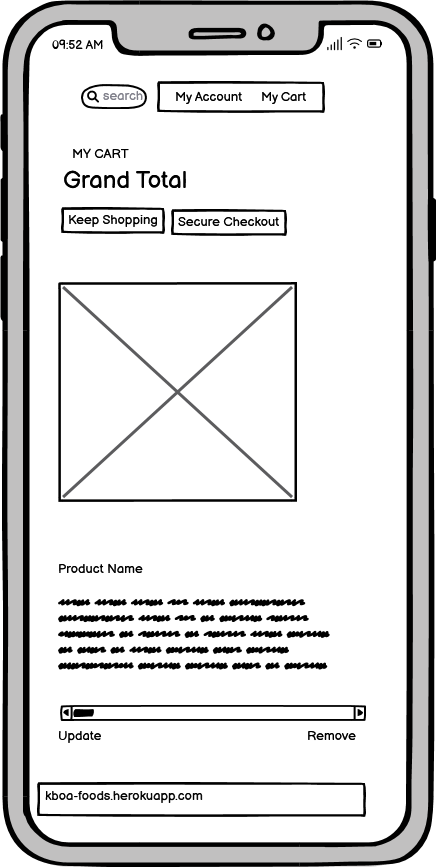

# KBOA Foods
KBOA Foods is a Business to Consumer (B2C) E-commerce Application Foodstore in Gbagada Lagos Nigeria. The web application was built for ease of shopping from anywhere and the items delivered to the client's location.
The store is a full fledge ecommerce application that uses a single payment form. It has been integrated with AWS and Stripe for payment details to conclude its transaction.

 Users with the weblink can shop from the website 

 Only registered users have access to crud functionalities on the application 

 Users are able to checkout their order. 

 Users are able to complete their order using stripe 

https://kboa-foods.herokuapp.com/

## Marketing Strategy:

 KBOA Foodstore is a B2C retail store where customers shop quality frozen foods and ready to cook food.

 For two years we have encouraged healthy eating and we are prepared to take it beyond and we are glad to deliver fresh healthy foods to your homes within Lagos.

### Target Audience:
Our application is targeted at online shoppers who would rather shop from the comfort of their home/environment. 

### Location:
We are available on all the listed social accounts.

*  Instagram 
*  Facebook 
*  Google 
*  Youtube 

### Content Strategy

*  Provide Food photos/videos on social media platforms 
*  Offer Food Recipes using our food products 
*  user-friendly website 
*  stand-out design with beautiful colors 
*  easy to use navigations 

### Market Offering:

*  We would offer coupon discounts to users 
*  We will recommend food products to the users 

### Our Main goal:

*  Our goal is to encourage healthy eating within our environment and beyond 
*  to provide the ease of shopping from anywhere 
*  support with ready to cook foods 
*  to be accessible to our target audience in their various locations 

### Advertising:

*  Free or low cost of Advert 
*  Facebook/Instagram Ads 

### Database Structure:

## Wireframes:

## User Story:

*  Navigation
    
    *  A site shopper can view a list of products from the main navigation
    *  A site shopper can quickly find products from the main navigation without having to search through all the products
    *  A site user can easily view the total in the cart to avoid spending too much
     

*  Registration and Accounts
    
    *  A site user can easily register for an account.
    *  A site user can easily login or logout
    *  A site user receive an email confirmation after registration
    *  A site user can have a personalized user profile.
    

*  Sort and Search
     
    *  Shoppers can easily find a specific product they would like to purchase
    *  Shoppers can quickly decide if the product they want is available.
    

    

*  Purchase and Checkout
    
    *  Shoppers can view order confirmation before checkout
    *  Shoppers can confidently provide their payment information to make a purchase
    *  Shoppers will receive an email confirmation after checkout
    

*  Shopping Cart
     
    *  Shoppers can view items in the shopping cart
    *  Shoppers can adjust items in their shopping cart
    *  A site shopper can edit/update items from the shopping cart
    

*  Wishlist
     
    *  This section has the social media icons, so users can find more information about the yoruba club on facebook, instagram, twitter and youtube.
    *  The icons when click on takes the user to the respective url.
    *  It gives the users ability to find and contact the club if they need to.
    

*  Social media links
     
    *  This section has the social media icons, so users can find more information about the blog on facebook, instagram, twitter and youtube.
    *  The icons when click on takes the user to the respective url.
    *  It gives the users ability to users to folluw us on all our socia media links.
    

## Testing

### Testing Overview

Testing was divided into different sections to ensure everything was tested individually with test cases developed for each area.

#### Validator Testing
All code files were validated using suitable validators for the specific language.
All code passed the validation, with only code generated by other parties producing errors or warnings.

#### Lighthouse Testing
Google's lighthouse testing was utilised to gain an overall assessment of the performance of the site. Whilst all the areas of the test return a green score above 90, the overall performance figure fluctuates depending on the speed of the internet connection when the test is performed, having returned scores as low as 92 and as high as 100 whilst running the test multiple times. The accessibility score suffered a couple of points due to utilising headings in a non sequential order through out the site. The best practice score is impacted by the mailchimp and stripe included javascript files along with the use of the bootstrap and jquery libraries. The SEO score returned a perfect 100.

### AmIResponsive
AmIResponsive was used to check how website renders on different screens.

*  The page works in different browser; Chrome, Safari, and my mobile device (iPhone11). 
*  I have tested that the navigation, home, login, logout, signup, create post button are all readable and easy to understand. 
*  All the forms work perfectly well. 

## Challenges
The major challenge that I experienced was timing.

*  Timing 
*  The wishlist view works but my functions are yet to work 

## Bugs

*  My migrations failed, i had to reset my database and remake new migrations
*  Authentication error at checkout
*  My statis files failed to load on AWS

## Technology Used

*  HTML: we used this to build all the webpage for this website. 
*  CSS: this was used to style our various pages. 
*  Gitpod: is an online IDE for GitHub and GitLab that launches ready-to-code dev environments for any project with a single click. www.gitpod.io www.gitpod.io 
*  Github: provides hosting for software development version control using Git. www.github.com 
*  Chrome Dev Tool: this was used extensively to test debug my code. 
*  Bootsrap 5.0
*  Django 3.8
*  Psycopg database
*  manage.py
*  Fontawesome 
*  Cloudinary Storage 
*  ElephantSQL 
*  Stripe 
*  Webhook 
*  json 
*  Django Countries 
*  Amazon Web Services 
*  ElephantSQL 
*  Django-allauth 

* Django
    * Django was used as the main python framework in the development of this project
    * Django AllAuth was utilised to provide enhanced user account management functionality.
* Heroku
    * Was used as the cloud based platform to deploy the site on
* Elephant PostgreSQL
    * Elephant PostgreSQL was used as the database for this project during development and in production.
* JavaScript
    * Custom JavaScript was utilised to enable the colour scheme functionality, the mobile menu, the enabling and disabling of buttons on forms to prevent users inadvertantly causing errors when trying to submit multiple forms at the same time, and to display the current image in the form rather than a hyperlink to the image itself.
* Bootstrap 4.6.2
    * Bootstrap was used for general layout and spacing requirements for the site.
* Font Awesome
    * Was used for access to several icons for different sections where icons were appropriate.
* CSS
    * Custom css was written for a large number of areas on the site to implement custom styling and escape a bootstrap look and feel to the site.
* HTML
    * HTML was used as the base language for the templates created for the site.

#### Packages Used

* VS Code was used to develop the site
* Git was utilised for version control and transferring files between the code editor and the repository
* GitHub was utilised for storing the files for this project
* Balsamiq was utilised to develop wireframes for the site from which the design was based

## Deployment
The site was deployed to Heroku. 

### Project Deployment - needs adapting for AWS and Stripe

The following steps were taken for deployment:
* Sign up / Log in to [Heroku](https://www.heroku.com/)
* From Heroku Dashboard page select 'Create New App'
* Give the project a name, select a suitable region, then select create app. The name for the app must be unique.
* This will create the app within Heroku and bring you to the deploy tab. From the submenu at the top, navigate to the resources tab.
* Go to [ElephantSQL](https://elephantsql.com/)
* Sign up / Log in to the dashboard
* From the ElephantSQL Dashboard page select 'Create New Instance'
* Give the the instance a name, select a suitable region, then select create instance
* Click on the new instance name and copy the database url
* Go back to your Heroku app
* Navigate to the setting tab, within the config vars section copy the DATABASE_URL to the clipboard for use in the Django configuration.
* Within the django app repository create a new file called env.py - within this file import the os library and set the environment variable for the DATABASE_URL pasting in the address copied 
  from Heroku. The line should appear as os.environ["DATABASE_URL"]= "Paste the link in here"
* Add a secret key to the app using os.environ["SECRET_KEY"] = "your secret key goes here"
* Add the secret key just created to the Heroku Config Vars as SECRET_KEY for the KEY value and the secret key value you created as the VALUE
* In the settings.py file within the django app, import Path from pathlib, import os and import dj_database_url
* insert the line if os.path.isfile("env.py"): import env
* remove the insecure secret key that django has in the settings file by default and replace it with SECRET_KEY = os.environ.get('SECRET_KEY')
* replace the databases section with DATABASES = { 'default': dj_database_url.parse(os.environ.get("DATABASE_URL"))} ensure the correct indentation for python is used.
* In the terminal migrate the models over to the new database connection
* Navigate in a browser to Amazon AWS, log in, or create an account and log in. 
* Create a new S3 bucket for the site and create a static directory and media directory within the bucket.
* From the dashboard - copy the bucket details into the settings file.
    * you will require the following:
        - Storage Bucket Name
        - Storage Bucket Region Name
        - Access Key ID
        - Secret Access Key
    * configure these settings in the settings file
* in the env.py file created earlier 
    - add os.environ["AWS_ACCESS_KEY_ID"] = "paste in your access key"
    - add os.environ["AWS_SECRET_ACCESS_KEY"] = "paste in your secret access key"
* In Heroku, add the keys and values copied to the clipboard to the config vars
* Also add the KEY - DISABLE_COLLECTSTATIC with the Value - 1 to the config vars
* this key value pair must be removed prior to final deployment
* Using the requirements.txt file install all of the required packages
* in the Settings.py file - add the STATIC files settings - the url, storage path, directory path, root path, media url and default file storage path.
* Link the file to the templates directory in Heroku TEMPLATES_DIR = os.path.join(BASE_DIR, 'templates')
* Change the templates directory to TEMPLATES_DIR - 'DIRS': [TEMPLATES_DIR]
* Add Heroku to the ALLOWED_HOSTS list the format will be the app name given in Heroku when creating the app followed by .herokuapp.com
* In your code editor, create three new top level folders, media, static, templates
* Create a new file on the top level directory - Procfile
* Within the Procfile add the code - web: guincorn PROJECT_NAME.wsgi
* In the terminal, add the changed files, commit and push to GitHub
* In Heroku, navigate to the deployment tab and deploy the branch manually - watch the build logs for any errors.
* Heroku will now build the app for you. Once it has completed the build process you will see a 'Your App Was Successfully Deployed' message and a link to the app to visit the live site.
* This project utilises Stripe as a payment platform provider - You can create a stripe account at www.stripe.com you will need a developer account to gain access to the api keys required to run the payment processes.
* Once you have successfully created your stripe account, insert the stripe public key, stripe secret key and stripe webhook key into the env.py file and the heroku config vars. Configure the settings file to point at the variables required. Stripe provide documentation on how to setup stripe within django which is easy to follow. It is available within the stripe developer site.

## Credit

*  Boutique Ado
*  Fontawesome 
*  W3schools for my code referencing https://www.w3schools.com/howto/ 
*  Adobe Stock for all my images https://stock.adobe.com/ng/Libraries 
*  Code Institute Student support 

## Acknowledgment 

A special thanks to my hubby for his all round support in making sure this project was a success. Thanks for all the cup of Teas.
